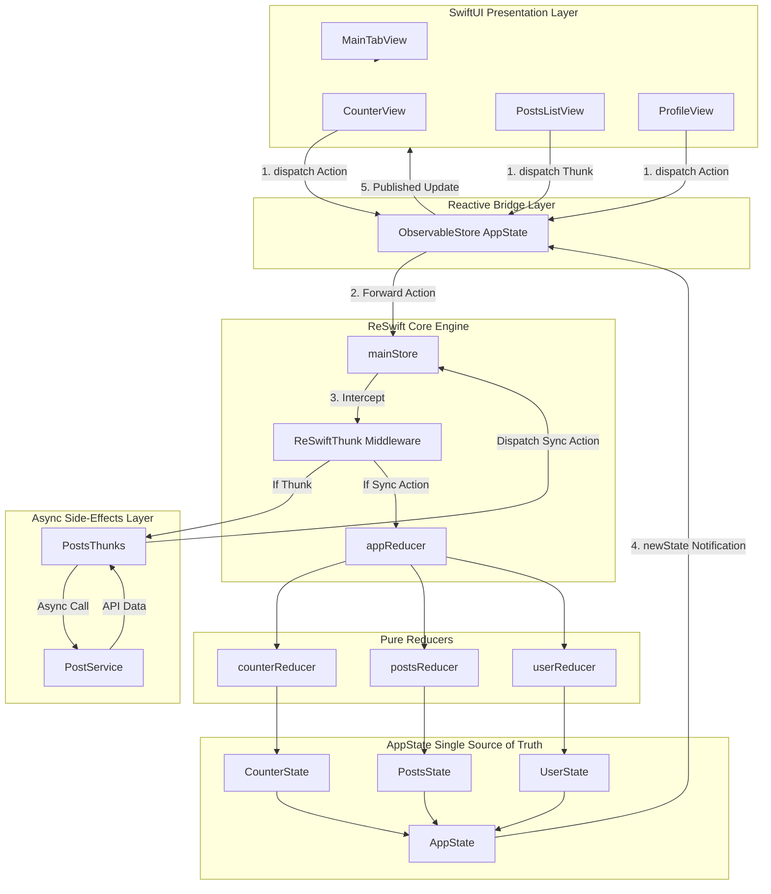
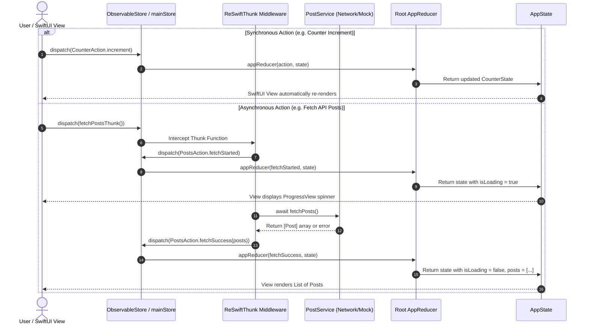

# 🚀 Learn ReSwift & ReSwiftThunk in SwiftUI

A structured, clean, and thoroughly documented iOS SwiftUI application designed to teach **ReSwift** (Redux architecture in Swift) and **ReSwiftThunk** (middleware for asynchronous side-effects).

---

## 📌 Table of Contents
- [Overview](#-overview)
- [System Architecture Diagram](#-system-architecture-diagram)
- [Core Redux Concepts](#-core-redux-concepts)
- [Data Flow Diagram](#-data-flow-diagram)
- [Domain State Tree](#-domain-state-tree)
- [Project Directory Structure](#-project-directory-structure)
- [Component Deep-Dive](#-component-deep-dive)
  - [1. AppState & Slices](#1-appstate--slices)
  - [2. Synchronous & Asynchronous Actions](#2-synchronous--asynchronous-actions)
  - [3. Pure Reducers](#3-pure-reducers)
  - [4. ReSwiftThunk (Side-Effects)](#4-reswiftthunk-side-effects)
  - [5. SwiftUI Bridge (`ObservableStore`)](#5-swiftui-bridge-observablestore)
- [Getting Started](#-getting-started)

---

## 📖 Overview

In traditional iOS architectures (MVC, MVVM), state is often fragmented across multiple ViewControllers, ViewModels, and Managers. This can lead to out-of-sync UI states, race conditions, and tricky debugging.

**ReSwift** introduces a single, immutable state tree and strictly **Unidirectional Data Flow (UDF)**. 
Combined with **SwiftUI** (`UI = f(State)`), state mutations become completely deterministic, predictable, and easy to test.

---

## 🏛 System Architecture Diagram

Below is the complete architectural overview showing how **SwiftUI Views**, the **ObservableStore bridge**, the **ReSwift Store**, **ReSwiftThunk Middleware**, **Pure Reducers**, and **AppState Slices** interact:



---

## 🏗 Core Redux Concepts

```
  ┌─────────────────────────────────────────────────────────────┐
  │                   ReSwift 3-Pillar Model                    │
  └──────────────────────────────┬──────────────────────────────┘
                                 │
         ┌───────────────────────┼───────────────────────┐
         ▼                       ▼                       ▼
    1. AppState              2. Actions             3. Reducers
 (Single Source of Truth) (Intent to change state) (Pure state functions)
```

1. **State (`StateType`)**: A single, immutable value type struct holding the entire application state tree.
2. **Actions (`Action`)**: Pure value types (enums/structs) representing events or intent to change state.
3. **Reducers (`(Action, State?) -> State`)**: Pure functions containing **no side-effects**. They take the current state and action to calculate a new state copy.
4. **Store (`Store<AppState>`)**: Global container holding the state tree, processing dispatched actions, and notifying subscribers.
5. **Thunk Middleware (`ReSwiftThunk`)**: Intercepts dispatched `Thunk<AppState>` functions to execute asynchronous tasks (URLSession API calls, timers) and dispatch pure actions upon completion.

---

## 🔄 Data Flow Diagram

### Synchronous vs. Asynchronous Lifecycle Flow



---

## 🌳 Domain State Tree

The `AppState` is decomposed into three isolated domain state slices:

```
                          ┌───────────────────┐
                          │     AppState      │
                          └─────────┬─────────┘
        ┌───────────────────────────┼───────────────────────────┐
        ▼                           ▼                           ▼
 ┌──────────────┐            ┌──────────────┐            ┌──────────────┐
 │ CounterState │            │  PostsState  │            │  UserState   │
 ├──────────────┤            ├──────────────┤            ├──────────────┤
 │ value: Int   │            │ posts: [Post]│            │ username     │
 │ step: Int    │            │ isLoading    │            │ email        │
 │ opsCount     │            │ searchQuery  │            │ isDarkMode   │
 └──────────────┘            └──────────────┘            └──────────────┘
```

---

## 📂 Project Directory Structure

```
XcodeProject/Learn ReSwift/Learn ReSwift/
├── App/
│   └── Learn_ReSwiftApp.swift         # App Entry Point & Environment Store Injection
├── Redux/
│   ├── State/
│   │   └── AppState.swift             # AppState & Sub-states (CounterState, PostsState, UserState)
│   ├── Actions/
│   │   ├── CounterActions.swift       # Synchronous counter actions
│   │   ├── PostsActions.swift         # Async posts lifecycle actions
│   │   └── UserActions.swift          # Profile & theme actions
│   ├── Reducers/
│   │   ├── CounterReducer.swift       # Pure reducer for counter logic
│   │   ├── PostsReducer.swift         # Pure reducer for posts logic & favorites
│   │   ├── UserReducer.swift          # Pure reducer for user settings
│   │   └── AppReducer.swift           # Root combined reducer composition
│   ├── Thunks/
│   │   └── PostsThunks.swift          # ReSwiftThunk async API fetching logic
│   └── Store.swift                    # ReSwift mainStore with ThunkMiddleware
├── Services/
│   ├── PostService.swift              # Async network service (URLSession + Mock fallback)
│   └── Models/
│       └── Post.swift                 # Immutable Post model (Codable, Identifiable)
├── Utilities/
│   └── ObservableStore.swift          # SwiftUI Bridge (StoreSubscriber + ObservableObject)
└── Views/
    ├── MainTabView.swift              # Main Tab Navigation Container
    ├── Counter/
    │   └── CounterView.swift          # View for synchronous actions
    ├── Posts/
    │   ├── PostsListView.swift        # View for ReSwiftThunk async operations
    │   └── PostRowView.swift          # Subview for post list items
    └── Profile/
        └── ProfileView.swift          # View for user settings & Redux state inspector
```

---

## 🔬 Component Deep-Dive

### 1. AppState & Slices
Defined in [AppState.swift](file:///Users/kmurugan/Documents/Personal/AntiGravity%20-%20Lab/iOS_ReSwift/XcodeProject/Learn%20ReSwift/Learn%20ReSwift/Redux/State/AppState.swift):
```swift
public struct AppState: StateType, Equatable {
    public var counterState: CounterState
    public var postsState: PostsState
    public var userState: UserState
}
```

### 2. Synchronous & Asynchronous Actions
Defined in [CounterActions.swift](file:///Users/kmurugan/Documents/Personal/AntiGravity%20-%20Lab/iOS_ReSwift/XcodeProject/Learn%20ReSwift/Learn%20ReSwift/Redux/Actions/CounterActions.swift) & [PostsActions.swift](file:///Users/kmurugan/Documents/Personal/AntiGravity%20-%20Lab/iOS_ReSwift/XcodeProject/Learn%20ReSwift/Learn%20ReSwift/Redux/Actions/PostsActions.swift):
```swift
public enum CounterAction: Action {
    case increment, decrement, reset, setStep(Int)
}

public enum PostsAction: Action {
    case fetchStarted
    case fetchSuccess([Post])
    case fetchFailed(String)
    case toggleFavorite(id: Int)
    case setSearchQuery(String)
}
```

### 3. Pure Reducers
Reducers in [AppReducer.swift](file:///Users/kmurugan/Documents/Personal/AntiGravity%20-%20Lab/iOS_ReSwift/XcodeProject/Learn%20ReSwift/Learn%20ReSwift/Redux/Reducers/AppReducer.swift) are pure functions without side-effects:
```swift
public func appReducer(action: Action, state: AppState?) -> AppState {
    return AppState(
        counterState: counterReducer(action: action, state: state?.counterState),
        postsState: postsReducer(action: action, state: state?.postsState),
        userState: userReducer(action: action, state: state?.userState)
    )
}
```

### 4. ReSwiftThunk (Side-Effects)
Defined in [PostsThunks.swift](file:///Users/kmurugan/Documents/Personal/AntiGravity%20-%20Lab/iOS_ReSwift/XcodeProject/Learn%20ReSwift/Learn%20ReSwift/Redux/Thunks/PostsThunks.swift):
```swift
public func fetchPostsThunk(service: PostServiceProtocol = PostService.shared) -> Thunk<AppState> {
    return Thunk<AppState> { dispatch, getState in
        dispatch(PostsAction.fetchStarted)
        Task {
            do {
                let posts = try await service.fetchPosts()
                await MainActor.run { dispatch(PostsAction.fetchSuccess(posts)) }
            } catch {
                await MainActor.run { dispatch(PostsAction.fetchFailed(error.localizedDescription)) }
            }
        }
    }
}
```

### 5. SwiftUI Bridge (`ObservableStore`)
Defined in [ObservableStore.swift](file:///Users/kmurugan/Documents/Personal/AntiGravity%20-%20Lab/iOS_ReSwift/XcodeProject/Learn%20ReSwift/Learn%20ReSwift/Utilities/ObservableStore.swift):
```swift
@MainActor
public final class ObservableStore<State: StateType>: ObservableObject, StoreSubscriber {
    @Published public private(set) var state: State
    public let store: Store<State>
    
    public init(store: Store<State>) {
        self.store = store
        self.state = store.state
        store.subscribe(self)
    }
    
    public nonisolated func newState(state: State) {
        Task { @MainActor in self.state = state }
    }
}
```

---

## 🛠 Getting Started

1. Open `XcodeProject/Learn ReSwift/Learn ReSwift.xcodeproj` in Xcode.
2. Select an iOS Simulator target (e.g. iPhone 15 Pro).
3. Press `Cmd + R` to build and run.
4. Experiment with:
   - **Counter Tab**: Synchronous action dispatching.
   - **Posts Tab**: Async Thunk fetching with live search & favorites.
   - **Profile Tab**: Dark mode toggle & cross-domain state inspection.
